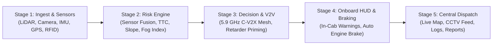

# 🛡️ Mine Lander (FRIDSS-SIH) — Project Memory & Architecture Guide

> **Project Name:** Mine Lander (Fleet Risk Detection & Intelligent Safety System - SIH)  
> **Domain:** Mining Haul Road Safety & Autonomous Collision Avoidance in Low-Visibility Open-Cast Mines  
> **Tech Stack:** Next.js 14 (App Router), TypeScript, Tailwind CSS, Web Audio API, Canvas/SVG Renderers, Lucide Icons  
> **Primary Use-Case Location:** Open-cast iron ore & coal mines (e.g., Bailadila Iron Ore Mines, NMDC / Coal India)

---

## 1. 📌 Project Overview & Problem Statement

### 🏔️ The Core Mining Challenge
In open-cast mines, heavy haul trucks (Dumpers carrying 100–240 metric tons of payload) traverse narrow, steep, multi-tiered haul roads with grades of 8% to 12%. During monsoon fog, heavy dust, cloud inversions, and night shifts:
- **Zero Human Visibility:** Optical line-of-sight drops down to **3–5 meters**.
- **Heavy Stopping Inertia:** A loaded 160-ton dumper traveling at 25–30 km/h requires **40–50+ meters** of braking distance on downhill slopes.
- **Blind Curves & Switchbacks:** Oncoming and slow-moving vehicles around steep S-curves are invisible to operators, leading to catastrophic haul road collisions.

### 💡 Mine Lander Solution
**Mine Lander** is a unified edge-to-cloud Mining Fleet Risk Detection & Collision Prevention Control Center. It integrates:
1. **Multi-Sensor Fusion (Camera + LiDAR / Radar + IMU + GNSS + RFID)** on haul vehicles.
2. **Vehicle-to-Vehicle (V2V / C-V2X) Telemetry Mesh** for instant low-latency inter-truck communication.
3. **Fog-Penetrating AI Vision (YOLO)** and obstacle proximity assessment.
4. **Autonomous Time-To-Collision (TTC) & Slope Risk Decision Engine** with retarder brake assistance.
5. **Central Mining Dispatch HUD** for real-time monitoring, event logging, and zone management.

---

## 2. 🏗️ Complete 5-Stage System Architecture



### Stage 1: Monitor & Detect (Edge Data Ingestion)
- **Cameras (VIS + Thermal/IR):** Low-light and thermal imaging with edge AI object detection.
- **LiDAR & mmWave Radar:** Penetrates dense monsoon fog, dust, and darkness (detecting objects up to 100+ meters).
- **GNSS / RTK GPS:** Precise coordinates, road speed, and heading angle.
- **6-Axis IMU (Inertial Measurement Unit):** Detects haul road slope (grade %), vehicle tilt/roll angle, and sudden deceleration.
- **RFID Scanners:** Identifies entrance and exit across predefined sectors (Pit, Haul S-Curve, Waste Dump).

### Stage 2: AI & Sensor Fusion Layer
- De-noises environmental interference (fog, rain particles, dust clouds).
- Computes **Relative Velocity ($V_{rel}$)** and **Time-To-Collision ($TTC = \frac{\text{Distance}}{V_{rel}}$)**.
- Evaluates road slope dynamics and computes **Vehicle Hazard Index (VHI)**.

### Stage 3: Low-Latency V2V Mesh (5.9 GHz C-V2X)
- Broadcasts high-frequency heartbeat packets directly between neighboring haulers without relying on central internet.
- Allows haulers approaching blind curves to "see" around mountain bends.

### Stage 4: Onboard Execution & Retarder Intervention
- In-cab heads-up alerts (Audio sirens + visual color-coded warnings).
- Autonomous actuation of hydraulic retarder brakes / engine compression braking when $TTC < 3.0\text{s}$.

### Stage 5: Central Control Center & Cloud Sync
- Syncs with central base stations via 4.8 / 5.8 GHz wireless link.
- Renders live tactical map, CCTV AI bounding boxes, RFID zone presence, and safety compliance reports.

---

## 3. 📂 Codebase Structure & Key Files

```
c:\Users\Fahad\Desktop\Projects\SIH\
├── src/
│   ├── app/
│   │   ├── globals.css          # Cyberpunk/Tactical Dark HUD styling, neon accents & glows
│   │   ├── layout.tsx           # Base HTML layout, metadata & typography
│   │   └── page.tsx             # Master Dashboard orchestrator for all tabs & HUD panels
│   ├── components/
│   │   ├── Header.tsx           # Top status bar (System clock, Weather/VHI, Sim speed, Mute, Scenarios)
│   │   ├── Sidebar.tsx          # Main navigation bar (Live Map, Fleet, CCTV, RFID, Logs, Arch, Story, Reports)
│   │   ├── LiveMap.tsx          # Real-time haul road tactical map (SVG/Canvas with curves, zones, vehicle nodes)
│   │   ├── TelemetryCards.tsx   # Detailed vehicle stats (Speed, TTC gauge, Obstacle dist, Slope, Sensor health)
│   │   ├── AIVisionCCTV.tsx     # CCTV feed with YOLOv9 bounding boxes, fog de-haze filter, and camera switcher
│   │   ├── CctvFullView.tsx     # Multi-camera matrix view with live detection stats
│   │   ├── RfidZonesPanel.tsx   # Compact sidebar widget for RFID checkpoint status
│   │   ├── RfidFullView.tsx     # Full RFID management matrix across Loading Pit, S-Curves, & Dump Yard
│   │   ├── FleetStatusView.tsx  # Fleet overview cards, quick emergency stops, and operational status
│   │   ├── EventLog.tsx         # Real-time telemetry event stream with severity badges & filters
│   │   ├── ArchitectureFlow.tsx # Interactive 5-stage architectural pipeline simulator
│   │   ├── UserStoryView.tsx    # Interactive storyline (Operator Raman's zero-visibility rescue scenario)
│   │   └── ReportsView.tsx      # Safety analytics, incident trends, MTBF, compliance exports
│   ├── context/
│   │   └── SimulationContext.tsx# Central React Context (physics loop, dynamic vehicle telemetry, scenarios)
│   ├── types/
│   │   └── index.ts             # TypeScript interfaces (Telemetry, Zones, Logs, Weather, Detections)
│   └── utils/
│       └── audio.ts             # Web Audio API sound synthesizer (beeps, warning chimes, critical sirens)
├── memory.md                    # THIS FILE (Comprehensive Project Guide)
├── package.json                 # Dependencies & project scripts
└── tailwind.config.ts           # Tactical color palette (hud-cyan, amber, red, slate)
```

---

## 4. 🎛️ Dashboard Views & Modules

| Tab / View | Component | Functionality |
| :--- | :--- | :--- |
| **Live Map** | `LiveMap.tsx` | Visualizes the S-curve haul road, vehicle nodes (`D-01`, `D-02`, `D-03`), heading vectors, dynamic collision proximity links, and RFID checkpoints. |
| **Fleet Status** | `FleetStatusView.tsx` | Displays all haulers with payload weight, fuel levels, current speeds, active operators, and emergency brake controls. |
| **AI CCTV Feed** | `AIVisionCCTV.tsx` / `CctvFullView.tsx` | Simulates optical + IR camera feeds with YOLOv9 bounding boxes, distance overlays, and AI Fog Filter toggles. |
| **RFID Zones** | `RfidZonesPanel.tsx` / `RfidFullView.tsx` | Tracks vehicle transitions between *Loading Bay Alpha*, *Hilltop Bend*, and *Waste Dump Apex*. |
| **Event Stream** | `EventLog.tsx` | Real-time audit log of proximity events, brake triggers, slope warnings, and sensor synchronization. |
| **Architecture** | `ArchitectureFlow.tsx` | Step-by-step interactive demonstration of data flow from hardware sensors to cloud analytics. |
| **User Story** | `UserStoryView.tsx` | Narrative-driven scenario of Operator Raman navigating dense monsoon fog at Bailadila Iron Ore Mines. |
| **Safety Reports** | `ReportsView.tsx` | Incident summary charts, Risk reduction statistics (-87% collision risk), compliance reports, and shift exports. |

---

## 5. 🔬 Key Formulas & Simulation Parameters

1. **Time To Collision (TTC):**
   $$\text{TTC} = \frac{\text{Distance to Obstacle }(m)}{\text{Relative Velocity }(m/s)}$$
   - $\text{TTC} > 6.0\text{s}$: `SAFE` (Green)
   - $3.0\text{s} \le \text{TTC} \le 6.0\text{s}$: `WARNING` (Amber - In-cab audio alert)
   - $\text{TTC} < 3.0\text{s}$: `CRITICAL` (Red - Autonomous retarder brake engagement)

2. **Vehicle Hazard Index (VHI):**
   Calculated based on environmental visibility ($V_{vis}$), humidity ($H$), road slope angle ($\theta_{slope}$), and vehicle speed ($S$):
   $$\text{VHI} = f(V_{vis}, H, \theta_{slope}, S) \in [0, 100\%]$$

---

## 6. 🧪 Simulation Scenarios (Available in Top Header)

The simulation engine in `SimulationContext.tsx` allows instant testing of real-world scenarios:
- **Nominal Operations:** Clear weather, $35\text{m}$ visibility, smooth flow, all vehicles safe.
- **Monsoon Fog Surge:** Visibility drops to $3.5\text{m}$, humidity jumps to $96\%$, VHI climbs to $94\%$, speed caps enforced.
- **Blind Curve Collision Risk:** `D-03` rapidly approaches `D-02` on an $8.9\%$ downhill slope with $\text{TTC} < 2.0\text{s}$, triggering emergency retarder brakes.
- **Slope Hazard:** Incline exceeds $11.2\%$, triggering hill descent assist and engine compression braking.

---

## 7. 🚀 Hardware & Integration Blueprint (For Physical Prototypes)

For hardware integration (ESP32 / Raspberry Pi / CAN-Bus / MQTT):
- **Communication Protocol:** JSON payload over MQTT / WebSockets (`ws://mine-control/telemetry`).
- **Telemetry Frequency:** 10 Hz (100ms interval) for real-time safety critical responsiveness.
- **Sample Payload Structure:**
  ```json
  {
    "vehicleId": "D-03",
    "timestamp": "17:31:31",
    "location": { "lat": 18.6721, "lng": 81.2415, "speed": 12.0, "heading": 115 },
    "proximity": { "distanceToObstacle": 9.6, "relativeVelocity": 4.7, "ttc": 2.0 },
    "imu": { "slope": 8.3, "tilt": 1.4 },
    "zone": { "zoneId": "zone-3", "status": "TRANSIT" },
    "machine": { "payload": 160.0, "fuelLevel": 55, "engineBrake": true },
    "sensorHealth": { "vis": true, "ir": true, "gps": true, "imu": true, "rfid": true, "lidar": true }
  }
  ```

---

*Authored for Mine Lander / FRIDSS-SIH Development & Demonstration Team.*
